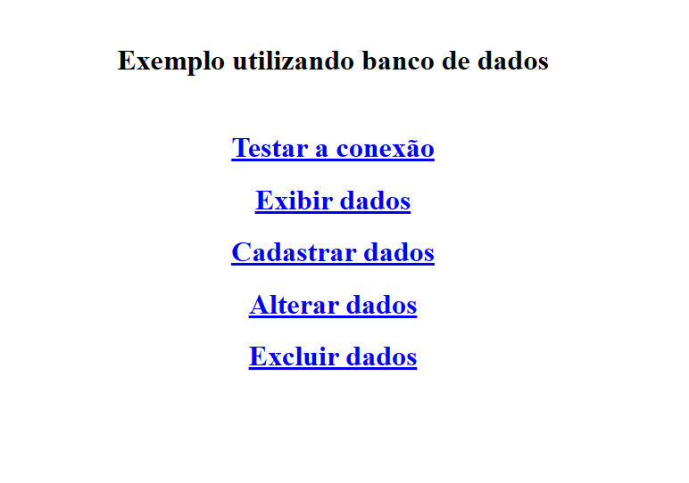
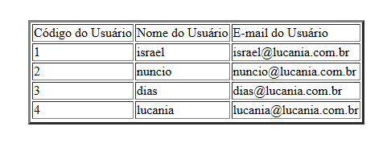
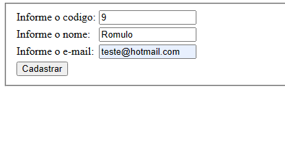
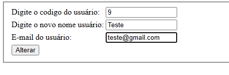
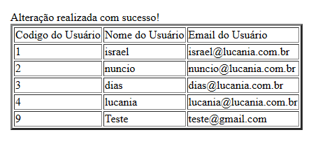
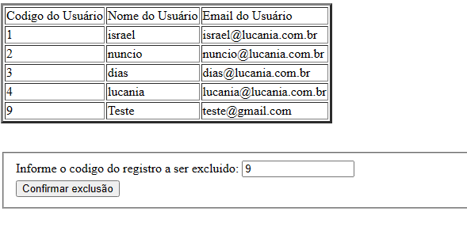
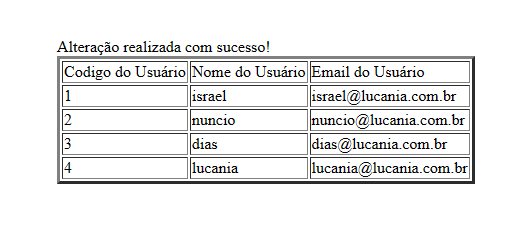

# codigosPHP-exemplo
exemplos de algumas conexões e coisas conectando php com o banco de dados no MYSQL 

  <h3>Menu com várias opções de teste</h3>
  

  

  <h3>Teste de Conexão e exibindo dados do banco de dados</h3>
   

  

  <h3>Exemplo de cadastro simples</h3>
  

  

  <h3>Exemplo de alteração de dados simples</h3>
  

  

  <h3>Deletando dados do banco de dados</h3>
  

  
